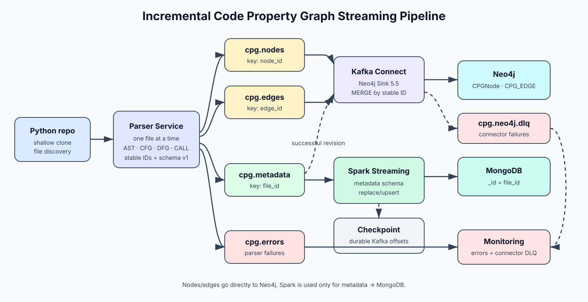

# System architecture

## Architecture diagram

The diagram below shows the final pipeline used in this lab. We kept the graph
and metadata paths separate because they have different storage and recovery
requirements.

## How data moves through the pipeline

| Path | Components | Responsibility |
|---|---|---|
| Discovery | shallow clone → manifest | deterministic list and content hashes |
| Topology | parser → `cpg.nodes`/`cpg.edges` → Kafka Connect → Neo4j | direct graph persistence; no Spark |
| File state | parser → `cpg.metadata` → Spark → MongoDB | current metadata document and offset recovery |
| Revision cleanup | `cpg.metadata` → Kafka Connect → Neo4j | remove older successful graph revision |
| Failures | `cpg.errors` / connector DLQ → monitoring | separate parser and infrastructure failures |

The parser is the only component that reads Python syntax. After parsing, Kafka
events become the shared contract for the rest of the pipeline. Neo4j receives
nodes and edges directly through Kafka Connect, while Spark reads only file
metadata and writes it to MongoDB.

## Replay handling

| Boundary | Mechanism | Failure/replay behavior |
|---|---|---|
| Parser | deterministic full SHA-256 IDs | unchanged content emits the same identities |
| Producer | stable Kafka key, `acks=all`, idempotent producer | a retry keeps the same key |
| Neo4j | uniqueness constraints and Cypher `MERGE` | at-least-once records update existing elements |
| Graph revision | stable `file_id`, changing `file_hash`, guarded `event_time` | same revision may replay; late older revision is rejected; successful metadata removes stale graph |
| MongoDB | `_id = file_id`, replace/upsert | one current document per repo-scoped file |
| Spark | persistent checkpoint | resumes from committed Kafka offsets |

Checkpointing and database idempotency are both required. A consumer can fail
after a database write but before committing its offset; replaying that record
must remain safe even though the checkpoint cannot eliminate the retry.

## Ordering and failures

Kafka does not provide ordering across separate topics. An edge may therefore
reach Neo4j before a corresponding node. The sink creates an endpoint
placeholder, then a later node event fills its properties. Verification fails
if an internal placeholder remains after consumer lag reaches zero.

A parse error is published to `cpg.errors` and metadata carries
`parse_status=error`. Neo4j deletes an older file revision only after successful
metadata, so a broken edit cannot erase the last known valid graph. Connector
conversion/write failures go to `cpg.neo4j.dlq`, which is monitored separately.

Node and edge queries accept the first observed file revision, another event
with the current content hash, or a strictly newer `event_time`. The metadata
query performs its state update and cleanup only when its event is non-stale.
This closes the late-old-revision race without assuming a total order across
topics. Same-revision retries remain idempotent. Verification still waits for
consumer lag zero because cross-topic endpoint ordering may temporarily leave a
placeholder; UTC producer timestamps and synchronized clocks are deployment
requirements for comparing different revisions.

## Local deployment

Docker Compose provides Kafka, Kafka UI, Neo4j, Kafka Connect, MongoDB and the
Spark job on one reproducible network. Kafka, Neo4j, MongoDB and Spark checkpoint
volumes survive container restarts. Host ports expose only the UIs and client
interfaces needed for evidence capture and verification.
