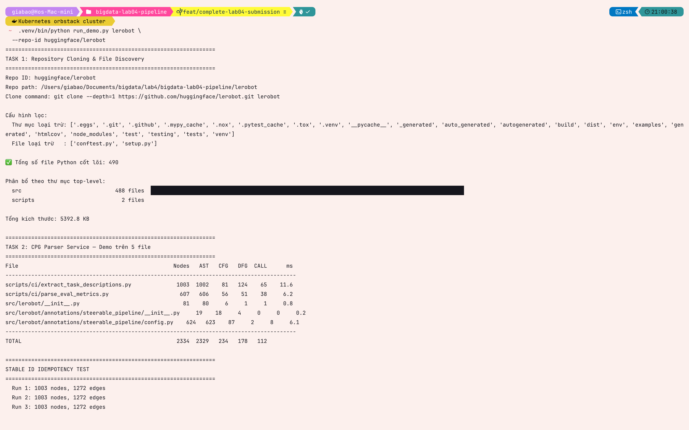

# Task 1 — Repository cloning and file discovery

## Approach and reasoning

The selected repository is shallow-cloned so the experiment has the current
tree without downloading its full history. The exact commit is recorded before
parsing; this makes file counts and hashes auditable even if LeRobot changes
later.

```bash
git clone --depth=1 https://github.com/huggingface/lerobot.git lerobot
git -C lerobot rev-parse --is-shallow-repository
git -C lerobot rev-parse HEAD
.venv/bin/python src/discovery.py lerobot
```

`src/discovery.py` walks the tree without following symlinks and keeps only
ordinary `.py` source files. It excludes VCS/virtual-environment/build folders,
test directories and filenames, `setup.py`, generated filename suffixes, and
files with a conventional generated-code header. Each manifest entry contains
a normalized relative path, byte size, absolute local path, and streaming
SHA-256 content hash. Entries are sorted by relative path, so repeated discovery
over one checkout is deterministic.

This policy is stricter than the assignment requires—the exclusions are
optional—but it prevents test and generated sources from dominating the graph.

## Verification commands

```bash
# Manifest is non-empty and has no duplicate relative path.
jq 'length' discovered_files.json
jq -r '.[].relative_path' discovered_files.json | sort | uniq -d

# These commands should print no paths.
jq -r '.[].relative_path' discovered_files.json \
  | rg '(^|/)(tests?|test_[^/]*|[^/]*_tests?)(/|\.py$)'
jq -r '.[].relative_path' discovered_files.json \
  | rg '(^|/)(setup|conftest)\.py$|(_gen|_generated|_pb2|_pb2_grpc)\.py$'
```

The automated discovery tests also create a temporary repository containing
normal, setup, test and generated files. They assert the same filtering rules,
sorted output, stable hashes, and a clear non-zero exit for a missing path.

```bash
.venv/bin/python -m unittest tests.test_discovery -v
```

## Final LeRobot evidence

Execution date: **2026-07-25**. The final manifest was produced from this pinned
checkout:

```text
origin: https://github.com/huggingface/lerobot.git
is shallow repository: true
commit: 0d383d09f2051444de211739196a28cc94736861
raw .py files before exclusions: 752
included Python source files: 490
duplicate relative paths: 0
excluded-pattern paths remaining: 0
```

| Measurement | Final value |
|---|---|
| Repository | `huggingface/lerobot` |
| Shallow clone | `true` |
| Pinned source commit | `0d383d09f2051444de211739196a28cc94736861` |
| Raw `.py` files | 752 |
| Included Python files | 490 |
| Excluded files | 262 |
| Duplicate manifest paths | 0 |
| Excluded-pattern paths found | 0 |

The first three deterministic manifest entries were:

```text
scripts/ci/extract_task_descriptions.py  8631 bytes
  sha256 7d1235a0b11643c68de0b5ae6de60c71c999f08b575ac07c91848abb440f40cb
scripts/ci/parse_eval_metrics.py         4969 bytes
  sha256 aa1b7cf39c277000e171802dfca5f251b9158bf029d89c57170161b4b2cf12b8
src/lerobot/__init__.py                  1965 bytes
  sha256 9de5fe33e0bf693e86e9bf55360942385a504a1baff224577a405ca91ea33838
```

## Captured execution evidence



The terminal capture records the real operator command, the selected
`huggingface/lerobot` repository, the active exclusion policy, and the final
490-file result. The lower portion also begins the bounded parser demonstration,
showing that the manifest is consumed in deterministic order rather than being
reported as a hand-entered total.

The executed notebook directly below this chapter asserts the discovery
acceptance criteria against the committed live-evidence summary. Task 2 has a
separate parser-only notebook, so cloning and discovery output is not duplicated
in the book navigation.

## Reflection

The first implementation filtered test directories but could still admit files
named `test_*.py` or `*_test.py` outside those directories, and a missing repo
could lead to an empty manifest followed by an unrelated demo failure. The
discovery boundary now filters both path components and filenames and validates
the repository path before walking it. Sorting and content hashes made the
manifest repeatable across runs; the unavoidable trade-off is that changing the
pinned upstream commit legitimately changes the count and must be documented.
