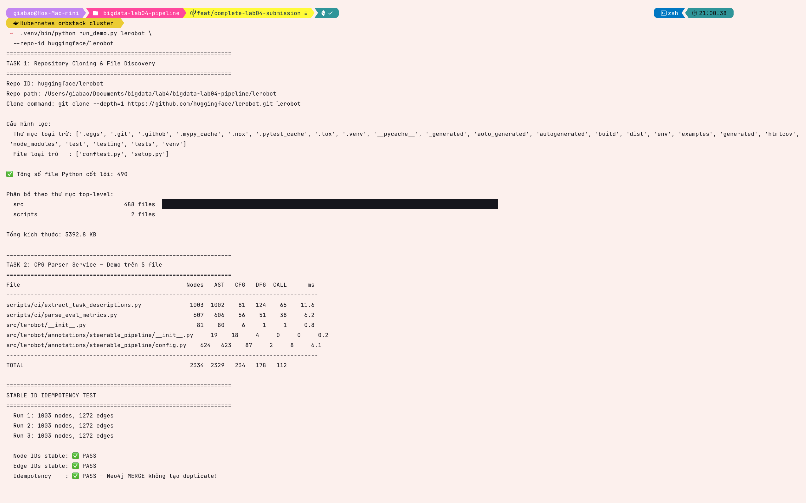

# Task 2 — Incremental CPG Parser Service

## Approach and reasoning

The parser uses Python's standard-library `ast` module and accepts one source
file per invocation. This bounds peak work to one file instead of building an
in-memory graph for the complete repository. A successful parse returns node,
edge and metadata events; a syntax or decoding failure returns metadata plus a
parser-error event and does not emit a partial graph.

The pinned LeRobot commit uses Python syntax that its own project targets but
Python 3.11 cannot parse in four files. The final repository discovery/parser
run therefore used **Python 3.14**. Python 3.11 remains appropriate for CI unit
tests and the Jupyter Book build, while Spark 3.5.1 runs in its dedicated Docker
image. Keeping those runtimes separate avoids weakening the parser by silently
dropping valid upstream files.

```bash
.venv/bin/python src/parser_service.py \
  lerobot/src/lerobot/__init__.py lerobot

.venv/bin/python -m src.kafka_publisher lerobot \
  src/lerobot/__init__.py \
  --repo-id huggingface/lerobot \
  --dry-run
```

## Extracted CPG elements

| Element | Representation | Scope |
|---|---|---|
| AST node | `cpg.nodes` event | every visited Python AST object |
| AST | `AST_CHILD` edge | parent-to-child syntax relation |
| CFG | `CFG_NEXT` edge | approximate sequential/branch flow |
| DFG | `DFG_USE` edge | definition-to-use within parser scope |
| Calls | `CALL` / `CALL_EXTERNAL` edge | resolved local functions or external symbol |

The CFG and DFG are intrafile approximations, not whole-program type or alias
analysis. This keeps execution bounded and requires no native parser dependency.

## Stable identity and event contract

- `file_id` is the full SHA-256 of the stable `repo_id` and normalized relative
  file path. It therefore remains stable when file content changes.
- `node_id` is a full SHA-256 identifier derived from `file_id`, the structural
  AST traversal path, and node type. The structural path also distinguishes
  locationless singleton nodes such as repeated `Load` and `Add` objects.
- `edge_id` includes type, endpoints, and a call-site discriminator where
  parallel-looking edges would otherwise collide.
- Every event contains `schema_version`, timezone-aware UTC `event_time`,
  `repo_id`, `file_id`, normalized `file_path`, `file_hash`, and `parse_status`.

The contract is tested by parsing the same source twice, checking full-length
and unique IDs, changing `repo_id`, exercising repeated call sites, validating
UTC timestamps, emitting a syntax error, and invoking both script and module
CLI modes.

```bash
.venv/bin/python -m unittest tests.test_parser_contract -v
```

## Final LeRobot evidence

The parser experiment used the first deterministic manifest entry from the
pinned checkout on **2026-07-25**:

```text
file: scripts/ci/extract_task_descriptions.py
sha256: 7d1235a0b11643c68de0b5ae6de60c71c999f08b575ac07c91848abb440f40cb
nodes: 1003
unique node IDs: 1003
AST edges: 1002
CFG edges: 81
DFG edges: 124
CALL/CALL_EXTERNAL edges: 65
all edges: 1272
unique edge IDs: 1272
stable IDs on exact replay: true
```

The bounded full-manifest dry run then processed all 490 included sources with
Python 3.14:

```text
files processed: 490
nodes emitted: 655365
edges emitted: 830472
parser errors: 0
```

| Measurement for selected file | Final value |
|---|---:|
| Nodes / unique node IDs | 1003 / 1003 |
| AST edges | 1002 |
| CFG edges | 81 |
| DFG edges | 124 |
| CALL edges | 65 |
| All edges / unique edge IDs | 1272 / 1272 |
| IDs identical on exact replay | `true` |
| Full manifest files / errors | 490 / 0 |
| Full manifest nodes / edges | 655365 / 830472 |

## Captured execution evidence



The five-file run reports AST, CFG, DFG, and call-edge totals. Parsing the
selected file three times produced the same 1,003 nodes and 1,272 edges; both
identity checks ended in `PASS`.

The compact repository-level record is retained at
`docs/evidence/task1_task2_lerobot_final.md`; the executed notebook below shows
the representative payloads and calculations.

```{admonition} Executed notebook
:class: important
The notebook below was run against the pinned LeRobot commit and the current
full-SHA-256 contract. It contains
sample node/edge/metadata payloads and the exact replay comparison. A discovery
entry may display the operator's absolute path for locating the file, but all
identity-bearing event paths and stable IDs use the repository-relative path.
```

## Reflection

An earlier position-only identifier could collide for AST objects that have no
line or column, and shortened digests weakened the uniqueness guarantee. The
current structural-path strategy uses the full digest and is protected by
contract tests. The first full run under Python 3.11 also exposed four
upstream-syntax failures; running the selected repository under Python 3.14
resolved them without exclusions. Standard `ast` made the parser predictable,
while the bounded intrafile CFG/DFG does not provide whole-program semantic
precision. Parser failures are retained as observable events instead of
terminating a repository-wide run.
