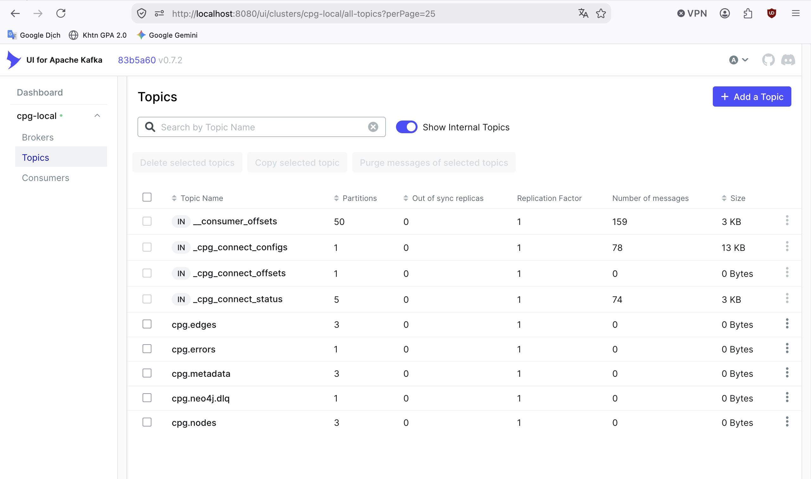
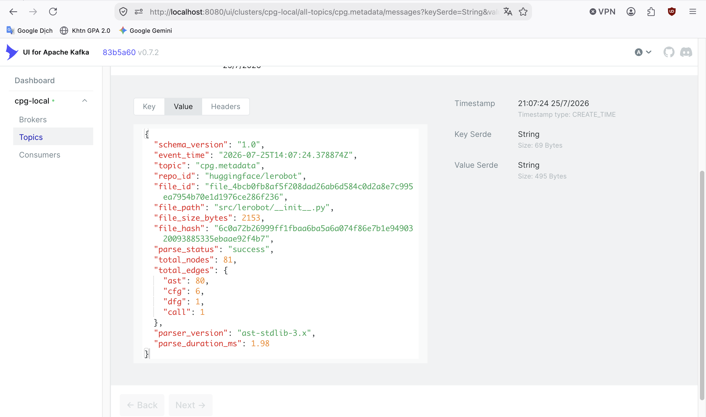
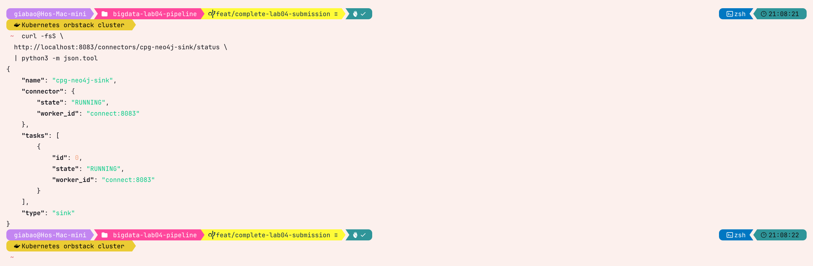

# Task 3 — Kafka topic design

## Approach and reasoning

The event contract separates graph topology, file state, and failures so each
consumer subscribes only to the data it owns. JSON Schema files in
`config/schemas/` version the payloads independently of broker configuration.

| Topic | Stable Kafka key | Partitions | Cleanup / retention | Consumer |
|---|---|---:|---|---|
| `cpg.nodes` | `node_id` | 3 | compact + delete / 7 days | Neo4j Sink |
| `cpg.edges` | `edge_id` | 3 | compact + delete / 7 days | Neo4j Sink |
| `cpg.metadata` | `file_id` | 3 | compact + delete / 30 days | Spark and reconciliation |
| `cpg.errors` | `file_id` | 1 | delete / 7 days | monitoring |
| `cpg.neo4j.dlq` | connector record key | 1 | delete / 14 days | connector operations |

The fifth topic is not a parser output: it is the Kafka Connect dead-letter
queue. Keeping it separate prevents connector failures from being interpreted
as domain-level parser errors.

Every domain payload includes `schema_version`, UTC `event_time`, `repo_id`,
`file_id`, `file_path`, `file_hash`, and `parse_status`. The producer validates
the payload before sending it with `acks=all`, Kafka idempotent delivery, and
the stable key in the table. Broker compaction is an operational optimization;
database constraints and upserts provide the durable idempotency guarantee.

```bash
docker compose --profile spark up -d --build
docker compose exec -T kafka kafka-topics \
  --bootstrap-server kafka:29092 --list

.venv/bin/python -m src.kafka_publisher lerobot \
  src/lerobot/__init__.py \
  --repo-id huggingface/lerobot
```

## Recorded integration evidence — fixture scope

Execution date: **2026-07-21**. Environment: Confluent Kafka 7.8.0 and the
project Docker Compose stack. The broker returned the following for
`cpg.nodes`; the bootstrap script applies the documented policy to all four
domain topics.

```text
PartitionCount: 3
ReplicationFactor: 1
cleanup.policy=compact,delete
retention.ms=604800000
```

The connector DLQ was empty after the run:

```text
cpg.neo4j.dlq:0:0
```

This is implementation evidence, not a claim that final LeRobot messages were
captured on that date. The complete raw record remains in
`docs/evidence/task3_task4_e2e.md`.

## Final LeRobot evidence

Execution date: **2026-07-25**. Publishing the 490-file manifest from pinned
commit `0d383d09f2051444de211739196a28cc94736861` produced:

```text
files / metadata events: 490
node events: 655365
edge events: 830472
parser error events: 0
```

The error topic exists and its final message count is zero:
`cpg.errors` existed with the documented one-partition policy, and automated
schema/parser tests exercise its error payload. All final repository messages
used schema version `1.0`, UTC `event_time`, repo ID `huggingface/lerobot`, and
stable entity keys. The final broker topic listing contained all four domain
topics and the operational DLQ; the connector DLQ remained empty after ingestion:

```text
cpg.neo4j.dlq:0:0
```

The final connector consumer check showed lag `0` for every partition of
`cpg.nodes`, `cpg.edges`, and `cpg.metadata` before database evidence was read.

## Captured UI and service evidence



Kafka UI shows the four required domain topics, their partition counts and
replication factor, plus the separate Neo4j DLQ. The retained log was empty at
the instant this overview was captured; an exact replay was then published to
produce the real metadata record shown next.



The Kafka UI message view exposes the actual versioned payload. It includes
`schema_version`, UTC `event_time`, stable `file_id`, normalized `file_path`,
content hash, parse status, node total and per-type edge totals.



The Kafka Connect REST response confirms that both the sink connector and its
task were `RUNNING` on worker `connect:8083` during evidence capture.

Useful terminal checks:

```bash
docker compose exec -T kafka kafka-topics \
  --bootstrap-server kafka:29092 --describe --topic cpg.metadata
docker compose exec -T kafka kafka-console-consumer \
  --bootstrap-server kafka:29092 --topic cpg.metadata \
  --from-beginning --max-messages 1 \
  --property print.key=true --property key.separator=' | '
```

## Reflection

A single mixed topic would couple graph and metadata consumers and make error
handling ambiguous. Separate topics and shared context fields resolved that
coupling. Kafka's at-least-once behavior still permits retries, so producer
idempotence and log compaction alone were not treated as sufficient; stable
keys are carried through to `MERGE` and replace/upsert operations downstream.
The separate DLQ also made a clean connector run measurable as an offset of
zero instead of silently dropping bad records.
