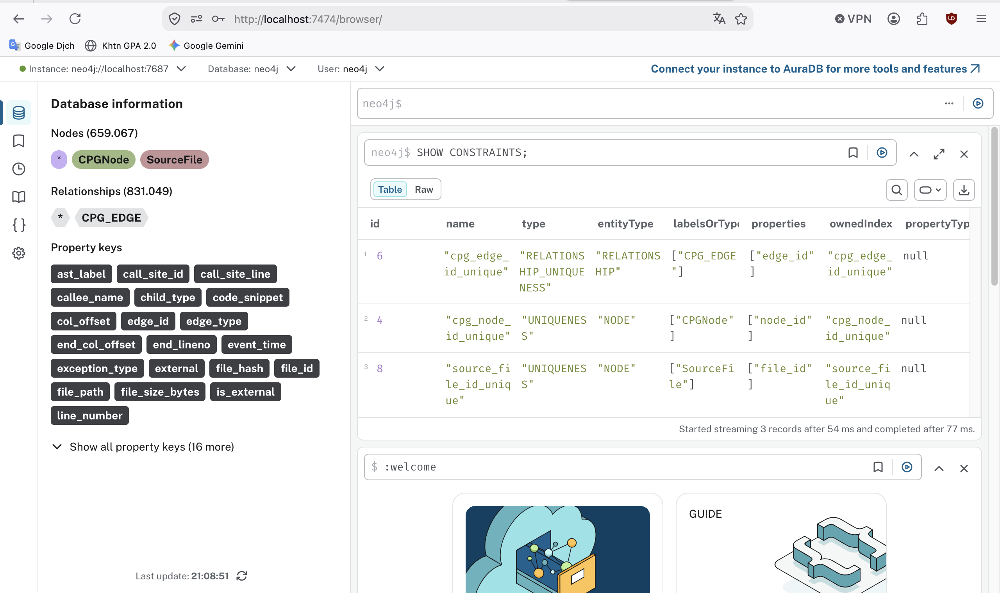
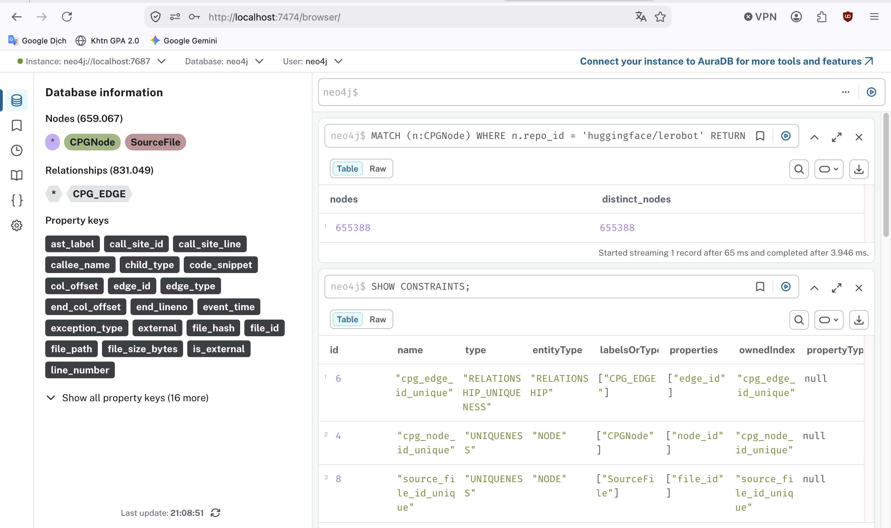
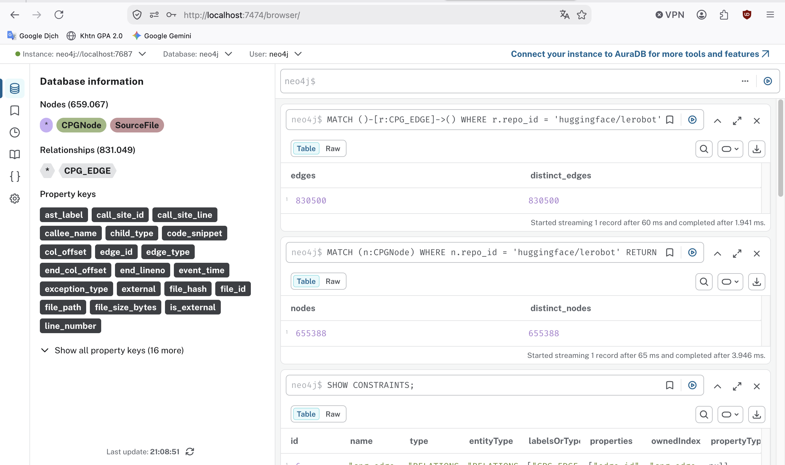
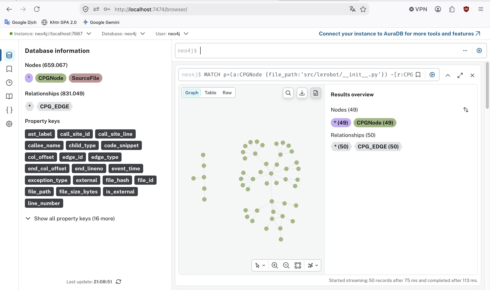

# Task 4 — Direct graph ingestion into Neo4j

## Approach and reasoning

`config/connectors/neo4j-sink.json` subscribes Kafka Connect directly to
`cpg.nodes` and `cpg.edges`; Spark is not present in the topology path. It also
observes successful `cpg.metadata` events to remove graph elements from an
older content hash after a file changes.

The graph model has `:CPGNode`, `:CPG_EDGE`, and file-state `:SourceFile`
elements. Neo4j constraints require unique `node_id`, `edge_id`, and `file_id`.
Every sink query uses `MERGE` by one of those identifiers and then updates
properties. Because Kafka topics are independently partitioned, an edge may
arrive before either endpoint; the edge query creates a safe placeholder and a
later node event fills it. Node and edge writes accept a first load, another
event for the same content hash, or a strictly newer `event_time`; metadata
updates and stale-revision cleanup likewise require a non-stale event. Exact
same-revision retries therefore remain valid while a late event from an older
revision cannot recreate graph state after reconciliation.

```bash
curl -fsS http://localhost:8083/connectors/cpg-neo4j-sink/status \
  | python -m json.tool

docker compose exec -T kafka kafka-consumer-groups \
  --bootstrap-server kafka:29092 \
  --group connect-cpg-neo4j-sink --describe

docker compose exec -T neo4j cypher-shell \
  -u neo4j -p cpg-password \
  -f /dev/stdin < infra/neo4j/verify.cypher
```

Consumer lag must reach zero before database counts are compared.

## Recorded integration evidence — fixture scope

Execution date: **2026-07-21**. Environment: Neo4j Community 5.26, Neo4j Kafka
Connector 5.5.0, and Confluent Connect 7.8.0.

### Connector health

```json
{
  "name": "cpg-neo4j-sink",
  "connector": {"state": "RUNNING", "worker_id": "connect:8083"},
  "tasks": [{"id": 0, "state": "RUNNING", "worker_id": "connect:8083"}],
  "type": "sink"
}
```

### Exact replay

`src/schemas.py` was published twice without a change. Both checks returned:

```text
nodes=467, distinct_node_ids=467
edges=497, distinct_edge_ids=497
placeholder_nodes=0
```

### Modified fixture

`tests/fixtures/replay_sample.py` was published with an added helper and then
published again after that helper was removed.

| Revision | Parser nodes | Parser edges | Neo4j nodes | Neo4j edges |
|---|---:|---:|---:|---:|
| Before edit | 35 | 40 | 35 | 40 |
| After edit | 23 | 26 | 23 | 26 |

After successful metadata reconciliation, only the current hash remained and
the query reported:

```text
file, status, expected_nodes, nodes, edges
"replay_sample.py", "success", 23, 23, 26
"src/schemas.py", "success", 467, 467, 497
```

These recorded values prove connector behavior for repository-owned fixtures.
They do not replace the final modified-LeRobot-file experiment in Task 6.

## Duplicate and stale-state queries

```cypher
MATCH (node:CPGNode)
WHERE coalesce(node.external, false) = false
RETURN count(node) AS nodes,
       count(DISTINCT node.node_id) AS distinct_nodes;

MATCH ()-[edge:CPG_EDGE]->()
RETURN count(edge) AS edges,
       count(DISTINCT edge.edge_id) AS distinct_edges;

MATCH (node:CPGNode {placeholder: true})
WHERE coalesce(node.external, false) = false
RETURN count(node) AS unresolved_internal_placeholders;
```

Success requires total and distinct counts to match and unresolved internal
placeholders to be zero after the connector catches up.

## Final LeRobot evidence

Execution date: **2026-07-25**. After the initial 490-file full load, both the
connector and task were `RUNNING`, every subscribed partition had lag `0`, and
the DLQ end offset was `0`. The initial repository-wide reconciliation query
returned:

```text
SourceFile records: 490
internal CPG nodes: 655365
distinct internal node IDs: 655365
CPG edges: 830472
distinct edge IDs: 830472
duplicate node ID groups: 0
duplicate edge ID groups: 0
unresolved internal placeholders: 0
```

The Task 6 target kept stable file ID
`file_4bcb0fb8af5f208dad26ab6d584c0d2a8e7c995ea7954b70e1d1976ce286f236`.
Its exact baseline replay remained at 58 nodes and 60 edges. After the source
edit it converged to 81 nodes and 88 edges; the exact modified replay kept those
same counts. Every phase had total IDs equal to distinct IDs and only the
current content hash remained. That controlled edit added 23 nodes and 28 edges,
so the **post-modification final graph** contained 655,388 nodes and 830,500
edges. Those totals again equalled their distinct-ID counts; `SourceFile`
cardinality remained 490. This explains why the initial full-load totals above
differ from the final database state without implying duplicates.

## Captured Neo4j Browser evidence



The live `SHOW CONSTRAINTS` result contains unique identities for
`CPGNode.node_id`, `CPG_EDGE.edge_id` and `SourceFile.file_id`. Neo4j Browser's
left-side database totals include external-call nodes and dated fixtures;
repository acceptance therefore uses the filtered queries below.



The repository-scoped query returns 655,388 nodes and 655,388 distinct node
IDs after the controlled source modification.



The relationship query returns 830,500 edges and 830,500 distinct edge IDs.



The bounded query for `src/lerobot/__init__.py` returned the connected graph
shown in Neo4j Browser.

## Reflection

At-least-once delivery and cross-topic ordering initially created two risks:
duplicates and relationships whose endpoint had not arrived. Uniqueness
constraints plus `MERGE` solved the first; explicit placeholders solved the
second without dropping edges. File metadata supplies the successful revision
boundary needed to remove stale elements. Per-file hash and `event_time` guards
also reject a delayed old revision, while allowing same-revision replays. Cleanup
is skipped for failed parses, preserving the last valid graph
instead of replacing it with an empty or partial revision. The remaining
ordering condition is endpoint arrival: acceptance waits for connector lag zero
and requires no unresolved internal placeholder. Producer timestamps are UTC,
so clock discipline remains part of the deployment assumptions.
