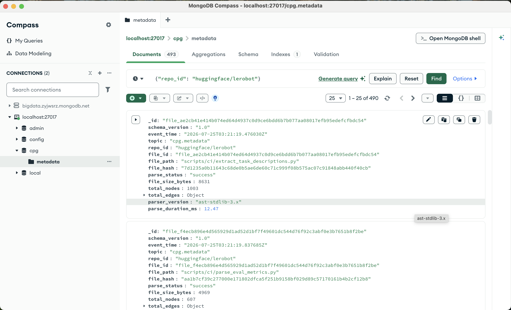
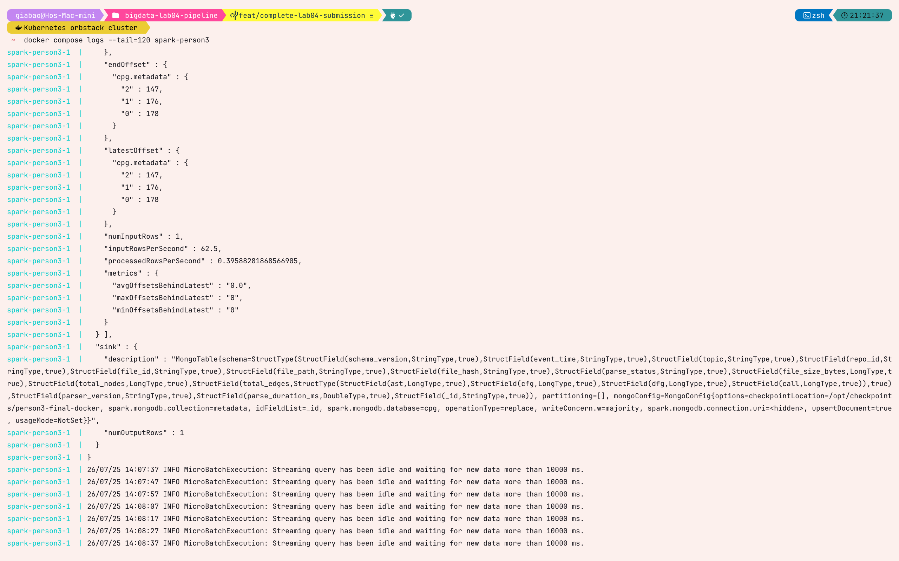
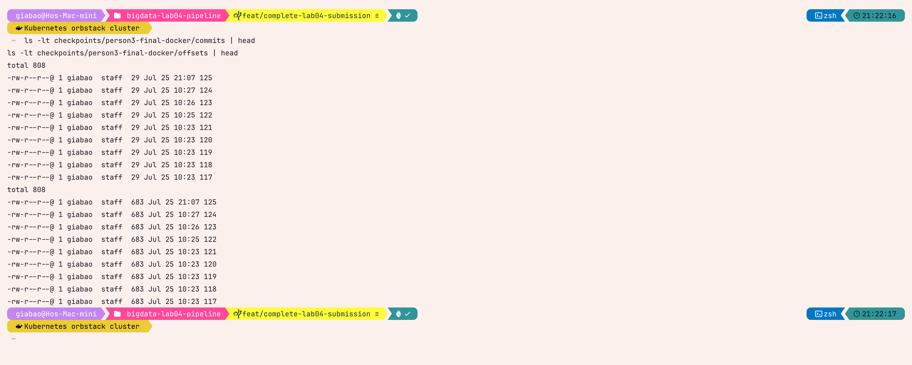

# Task 5 — Source metadata ingestion into MongoDB

## Approach and reasoning

Spark Structured Streaming subscribes only to `cpg.metadata`. It parses Kafka
JSON with a fully declared nested schema, rejects incomplete records, and sets
MongoDB `_id` to the parser-provided `file_id`. The MongoDB Spark Connector
writes with `operationType=replace`, `upsertDocument=true`, and majority write
concern. A new revision of the same file therefore replaces one current-state
document instead of adding a second copy.

```bash
docker compose --profile person3 up -d spark-person3
docker compose logs --tail=200 -f spark-person3
```

The Compose service runs Spark 3.5.1 with the Kafka SQL package and MongoDB
Spark Connector 10.7.0. Its durable host-mounted checkpoint is
`./checkpoints/person3-final-docker`; that path must remain unchanged during a
restart test.

```bash
docker compose exec -T mongodb mongosh cpg --quiet --eval '
printjson({
  total: db.metadata.countDocuments({}),
  duplicates: db.metadata.aggregate([
    {$group:{_id:"$file_id", copies:{$sum:1}}},
    {$match:{copies:{$gt:1}}}
  ]).toArray()
})'
```

Success requires `duplicates: []`, `_id == file_id`, and metadata counts/hash
equal to the parser event.

## Recorded integration evidence — fixture scope

Execution date: **2026-07-24**. Environment: Spark 3.5.1, MongoDB Spark
Connector 10.7.0, and MongoDB 7.0.12 under Docker Compose.

### Initial batch

```text
batchId: 0
numInputRows: 6
endOffset: {cpg.metadata: {0: 4, 1: 2, 2: 0}}
maxOffsetsBehindLatest: 0
MongoStreamingWrite: committed
checkpoint commit: /opt/checkpoints/person3-final-docker/commits/0
```

Those six records represented repeated revisions of three stable files. The
collection held exactly three current documents:

```text
document_count: 3
duplicate_groups: []
```

### Exact replay

The replay fixture was sent again with stable key:

```text
file_c5fd1983101a4aa656816fbb6d3d62075ae747c5c9df9d6a5833e4c6228c28ec
```

After the next micro-batch:

```text
total_documents: 3
documents_for_file_id: 1
total_nodes: 23
```

### Checkpoint restart

Spark was stopped and started with no new event and the same checkpoint:

```text
Resuming at batch 2 with committed offsets
{cpg.metadata: {0: 5, 1: 2, 2: 0}}
available offsets
{cpg.metadata: {0: 5, 1: 2, 2: 0}}
Streaming query has been idle and waiting for new data
```

MongoDB remained unchanged:

```text
total_documents: 3
documents_for_replayed_file_id: 1
event_time: 2026-07-24T16:42:23.997639Z
```

This proves schema compatibility, connector replace/upsert, and persisted
offset recovery for the committed fixture run. The raw record is retained in
`docs/evidence/task5_spark_mongodb_e2e.md`.

## Restart verification procedure

```bash
# Record collection state and latest committed offsets.
docker compose stop spark-person3
find checkpoints/person3-final-docker/commits -maxdepth 1 -type f | sort

# Start without deleting or changing the checkpoint.
docker compose start spark-person3
docker compose logs --since=5m spark-person3
```

With no new Kafka record, committed and available offsets must match and the
MongoDB document count and `event_time` must remain unchanged. When one new
revision is published, exactly that new offset is processed and the matching
`_id` is replaced.

## Final LeRobot evidence

Execution date: **2026-07-25**. MongoDB contained one current document for each
of the 490 LeRobot source files:

```text
LeRobot documents: 490
distinct LeRobot file_id values: 490
duplicate LeRobot file_id groups: []
whole collection documents: 493
```

The additional three collection documents belong to the dated fixture runs
reported above, not duplicate LeRobot paths. For the modified Task 6 file,
MongoDB contained exactly one document with `_id == file_id`, hash
`6c0a72b26999ff1fbaa6ba5a6a074f86e7b1e9490320093885335ebaae92f4b7`,
81 nodes, and edge totals `80 + 6 + 1 + 1 = 88`.

Spark was then stopped and started with the same checkpoint. Its recovery log
showed no new input after restart:

```text
Resuming at batch 125 with committed offsets
{cpg.metadata: {0: 178, 1: 175, 2: 147}}
and available offsets
{cpg.metadata: {0: 178, 1: 175, 2: 147}}
Streaming query has been idle and waiting for new data
```

The latest committed batch remained 124, the committed offset total remained
500, pending batches remained empty, and the target document—including its
`event_time`—was byte-for-byte unchanged in the verifier's normalized snapshot.

## Captured MongoDB and Spark evidence



MongoDB Compass applies the repository filter and reports 490 matching
documents. The displayed documents contain stable `_id`/`file_id`, content
hash, parse status, node totals and structured edge totals written by Spark.



The real container log shows committed and latest Kafka offsets equal for all
three `cpg.metadata` partitions, one row written through the MongoDB sink, and
zero records of lag before the stream returns to its idle wait.



The host-mounted checkpoint contains matching commit and offset entries through
batch 125. Reusing this directory is what allows the restarted query to resume
instead of consuming unchanged offsets from the beginning.

## Reflection

Checkpointing and idempotent database writes solve different failure windows.
A checkpoint prevents already committed Kafka offsets from being scheduled
again after a normal restart, but a task may fail after MongoDB accepts a write
and before Spark commits the batch. Replace/upsert by stable `_id` makes that
retry safe. Strict schema filtering also prevents malformed JSON from creating
partial documents. Reusing the exact checkpoint path was essential; starting
with a fresh directory correctly behaves like a new consumer and is not a valid
resume test.
