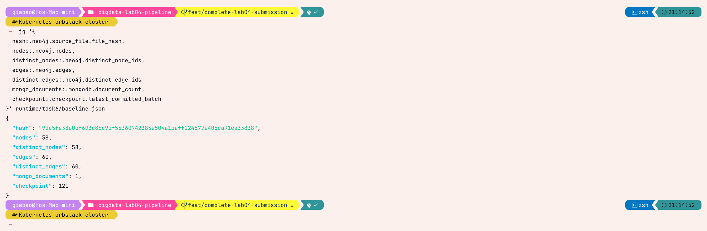
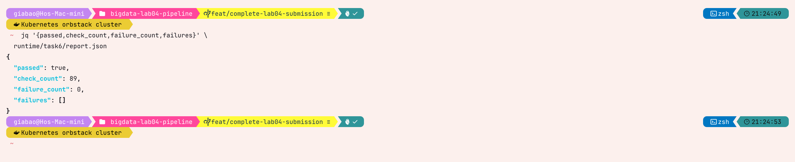

# Task 6 — Idempotent modified-file replay

## Experiment design

This task checks state transitions as well as exact-message replay.
One LeRobot file keeps the same repo-scoped `file_id` while its content hash and
CPG change. The complete pipeline must converge on the new current state without
retaining duplicate or stale elements.

```text
baseline revision -> exact baseline replay -> modified revision
                  -> exact modified replay -> Spark restart, same checkpoint
```

The controlled target should be a small source file such as
`src/lerobot/__init__.py`. Record the initial Git diff first and make one harmless,
small, marked source change—for example, add a tiny function—so the before and
after parser totals are explainable.

## Reproducible procedure

### 1. Establish the baseline

```bash
git -C lerobot status --short
shasum -a 256 lerobot/src/lerobot/__init__.py

.venv/bin/python -m src.kafka_publisher lerobot \
  src/lerobot/__init__.py --repo-id huggingface/lerobot

# Wait for Kafka Connect lag to become zero and Spark to commit, then snapshot
# Neo4j, MongoDB and the checkpoint in one read-only command.
.venv/bin/python scripts/verify_replay.py src/lerobot/__init__.py \
  --repo-id huggingface/lerobot \
  --checkpoint-location checkpoints/metadata-stream \
  --output runtime/task6/baseline.json
```

Publish the unchanged file one more time and prove the Neo4j totals and MongoDB
document count remain identical. After both consumers settle, capture
`runtime/task6/exact-replay.json` using the same snapshot command. This isolates
exact-replay idempotency before the source is edited.

### 2. Modify and publish only one file

Append a harmless `lab04_replay_marker` function, verify that exactly one file
is dirty, and publish only its relative path:

```bash
git -C lerobot diff -- src/lerobot/__init__.py
shasum -a 256 lerobot/src/lerobot/__init__.py

.venv/bin/python -m src.kafka_publisher lerobot \
  src/lerobot/__init__.py --repo-id huggingface/lerobot
```

Wait until connector lag is zero and Spark has committed the new micro-batch.
Then collect the same snapshot:

```bash
.venv/bin/python scripts/verify_replay.py src/lerobot/__init__.py \
  --repo-id huggingface/lerobot \
  --checkpoint-location checkpoints/metadata-stream \
  --output runtime/task6/modified.json

docker compose exec -T neo4j cypher-shell \
  -u neo4j -p cpg-password \
  -f /dev/stdin < infra/neo4j/verify.cypher
```

The new file hash must differ. Neo4j totals must match the modified parser
metadata, total IDs must equal distinct IDs, and only the new `file_hash` may
remain for that `file_id`. MongoDB must contain exactly one document whose
`_id`, `file_id`, new hash, and parser totals match the event.

### 3. Replay the new revision and restart Spark

Publish the modified file a second time, prove all database cardinalities stay
unchanged, and save `runtime/task6/modified-replay.json`. Then restart Spark
without changing or deleting its checkpoint:

```bash
docker compose stop spark-metadata
docker compose start spark-metadata
docker compose logs --since=5m spark-metadata

# With no new publish after restart, take the fifth snapshot.
.venv/bin/python scripts/verify_replay.py src/lerobot/__init__.py \
  --repo-id huggingface/lerobot \
  --checkpoint-location checkpoints/metadata-stream \
  --output runtime/task6/restart.json
```

With no new event after restart, Spark's committed and available offsets must be
equal and MongoDB's count and `event_time` must not change.

### 4. Verify the complete sequence

The acceptance verifier checks every snapshot internally and then compares the
four required phases plus the optional modified exact-replay phase. It exits
with status 1 when any invariant fails, making the result suitable for a report
cell or CI log.

```bash
.venv/bin/python scripts/verify_replay.py \
  --verify \
    runtime/task6/baseline.json \
    runtime/task6/exact-replay.json \
    runtime/task6/modified.json \
    runtime/task6/restart.json \
  --modified-replay runtime/task6/modified-replay.json \
  --output runtime/task6/report.json

jq '{passed, check_count, failure_count}' runtime/task6/report.json
```

The required summary is `passed: true` and `failure_count: 0`. Among other
invariants, the report checks unique graph IDs, one MongoDB document, matching
parser/database counts, one current hash, advancing offsets for published
events, and unchanged graph/document/checkpoint state after an idle restart.

## Preliminary component evidence

The committed integration records establish each mechanism separately:

| Mechanism | Recorded result | Scope / date |
|---|---|---|
| Exact Neo4j replay | 467 nodes and 497 edges; total = distinct | `src/schemas.py`, 2026-07-21 |
| Modified graph reconciliation | 35/40 became 23/26 with old hash absent | replay fixture, 2026-07-21 |
| MongoDB exact replay | 3 total documents; one for replayed `file_id` | replay fixture, 2026-07-24 |
| Spark checkpoint restart | committed offsets = available offsets; stream idle | fixture stack, 2026-07-24 |

Because those checks occurred on separate dates, this table does **not** claim
they are one final end-to-end LeRobot run. The experiment above supplies that
single-run evidence.

## Final LeRobot results

Execution date: **2026-07-25**. Target file:
`src/lerobot/__init__.py`; stable file ID:
`file_4bcb0fb8af5f208dad26ab6d584c0d2a8e7c995ea7954b70e1d1976ce286f236`.
The modification added the documented `_lab04_replay_probe` function.

Full hashes:

```text
baseline: 9de5fe33e0bf693e86e9bf55360942385a504a1baff224577a405ca91ea33838
modified: 6c0a72b26999ff1fbaa6ba5a6a074f86e7b1e9490320093885335ebaae92f4b7
```

| Measurement | Baseline | Exact baseline | Modified | Exact modified | Restart |
|---|---:|---:|---:|---:|---:|
| File hash | `9de5fe…33838` | `9de5fe…33838` | `6c0a72…2f4b7` | `6c0a72…2f4b7` | `6c0a72…2f4b7` |
| Parser / Neo4j nodes | 58 / 58 | 58 / 58 | 81 / 81 | 81 / 81 | 81 / 81 |
| Parser / Neo4j edges | 60 / 60 | 60 / 60 | 88 / 88 | 88 / 88 | 88 / 88 |
| Distinct node / edge IDs | 58 / 60 | 58 / 60 | 81 / 88 | 81 / 88 | 81 / 88 |
| Duplicate node / edge groups | 0 / 0 | 0 / 0 | 0 / 0 | 0 / 0 | 0 / 0 |
| Current graph hashes | 1 | 1 | 1 | 1 | 1 |
| MongoDB documents for file | 1 | 1 | 1 | 1 | 1 |
| MongoDB hash matches graph | yes | yes | yes | yes | yes |
| Checkpoint batch | 121 | 122 | 123 | 124 | 124 |
| Committed offset total | 497 | 498 | 499 | 500 | 500 |
| Pending checkpoint batches | 0 | 0 | 0 | 0 | 0 |

The modified graph contained 80 AST, 6 CFG, 1 DFG and 1 external-call edge.
The MongoDB collection stayed at 493 documents throughout the source change and
replays. The final Kafka Connect check reported lag `0` on every node, edge and
metadata partition.

After the idle restart, Spark resumed at batch 125 with committed and available
offsets both equal to `{0: 178, 1: 175, 2: 147}`. Batch 124 and total offset 500
therefore remained the last commit, while graph state, the target MongoDB
document (including `event_time`), collection fingerprint and cardinality all
remained unchanged.

The automated sequence report returned:

```json
{
  "passed": true,
  "check_count": 89,
  "failure_count": 0,
  "failures": []
}
```

The compact raw-evidence transcript is retained in
`docs/evidence/task6_lerobot_final.md`.

## Captured replay evidence



Before the source edit, the target contained 58 unique nodes, 60 unique edges,
one MongoDB document and checkpoint batch 121.


After adding the replay probe and processing only that file, the content hash
changed and the graph converged to 81 unique nodes and 88 unique edges. MongoDB
still contained exactly one current document, while Spark advanced only to the
new metadata offset.



The final verifier reports `passed: true`: all 89 checks ran, with no failed
checks and an empty failure list. The measurement table above uses these
before-and-after values.

## Reflection

Stable IDs prevent duplicate identity, but they do not by themselves remove CPG
elements that disappeared from a changed file. A successful metadata event is
therefore the revision boundary for Neo4j stale-state cleanup. MongoDB models
one current document per `file_id`, so replace/upsert naturally supersedes the
old hash. Finally, Spark checkpoint evidence must be captured after a real stop
and restart; starting a fresh query does not test checkpoint recovery. The
two-stage exact-and-modified replay separates duplicate safety from update
correctness and makes failures easier to diagnose.
